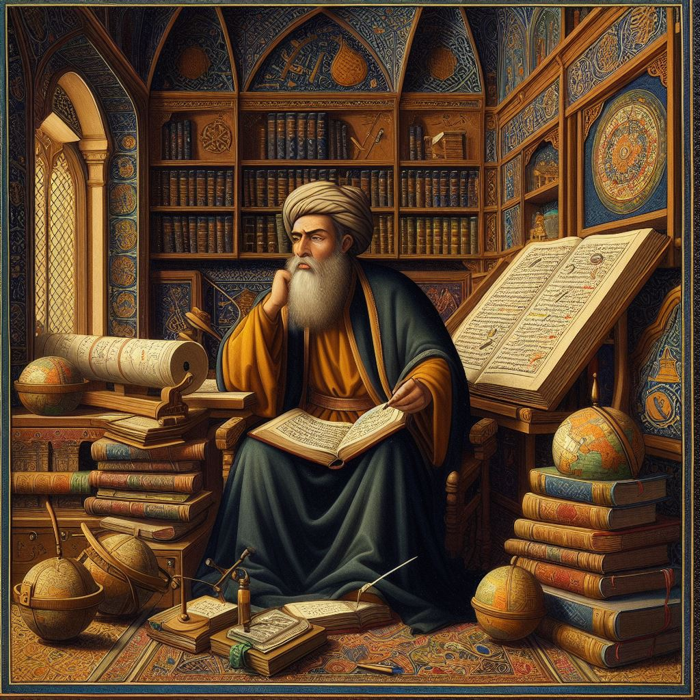

# Fundamentals of Computer and Programming Course

{ width="150"  align=right loading=lazy}

Our course, "Fundamentals of Computer and Programming in C," at [Amirkabir University of Technology](http://ce.aut.ac.ir){ target="_blank" } provides a comprehensive introduction to the principles of computing and structured programming using the C language. It is designed to equip students with essential programming skills, covering topics like decision-making, loops, functions, arrays, pointers, and file handling. The course emphasizes problem-solving and algorithmic thinking, enabling students to develop efficient, modular, and maintainable programs. Additionally, students will explore foundational concepts in data structures, dynamic memory management, and advanced programming techniques. By the end of the course, participants will be proficient in applying C programming to solve real-world problems and prepare for further studies in computer science.

---

## Course Objectives

This course aims to:

- Introduce students to the fundamentals of computing and structured programming using the C language.
- Develop problem-solving skills and algorithmic thinking essential for programming.
- Provide an understanding of basic and advanced programming constructs, such as decision-making, loops, and data structures.
- Build proficiency in designing, debugging, and optimizing C programs.
- Equip students with knowledge of file handling and dynamic memory allocation.
- Foster the ability to apply programming skills to real-world problems and case studies.

---

## Learning Outcomes

- By the end of the course, students will:

    * Write efficient, modular, and maintainable C programs.
    * Understand the fundamentals of computer science and structured programming.
    * Solve complex problems using algorithms and data structures.
    * Develop real-world applications using C programming skills.

--- 

## Course Outline

### 1. Introduction to Computing
{ width="150"  align=right loading=lazy}
- Fundamentals of computing
- Historical perspective and early computers
- Overview of hardware, software, and the Internet

### 2. Introduction to C Programming
- Basics of C programming
- Input/output operations
- Data types and arithmetic operations

### 3. Decision-Making Statements
- `if`, `if-else`, and nested `if`
- `switch` statements for multi-way branching
- Logical operators and expressions

### 4. Repetition Statements
- `for` loops for counter-controlled repetition
- `while` loops for condition-controlled repetition
- `do-while` loops for post-condition checks
- Break and continue statements for loop control

### 5. Structured Program Development
- Algorithm development and problem-solving
- Functions and recursion
- Enumerations and random-number generation

### 6. Arrays, Pointers, and Strings
- One-dimensional and two-dimensional arrays
- Pointer operations and relationships with arrays
- String manipulation and character processing

### 7. Formatted Input/Output and File Processing
- Using `scanf` and `printf` for formatted I/O
- File handling (text and binary files, sequential and random access)

### 8. Data Structures and Algorithms
- Dynamic memory allocation
- Lists, stacks, queues, and binary trees
- Sorting algorithms and Big-O notation

### 9. Advanced Topics
- Preprocessor directives (`#include`, macros, conditional compilation)
- Command-line arguments and multi-source file programs
- Signal handling and advanced memory management

### 10. Case Studies
- Real-world applications in computer science, data science, and artificial intelligence
- Building a compiler and virtual machine simulation

---

## Team 

### Instructor

[**Morteza Zakeri**](https://dl.acm.org/profile/99660089625){ target="_blank" }†

† Ph.D. in Computer Science, ACM Member (`mzakeri-nasrabadi[at]acm.org`).

### Teaching Assistants

* TA Head (Spring 2025): Fatemeh Abdi
* TA Head (Spring 2024): Mahdi Haeri 

---

## Additional Information

- **Prerequisites**: No prior programming experience required. Familiarity with basic mathematics will be beneficial.
- **Assessment Methods**: Graded assignments, quizzes, practical programming tasks, paper-based exams, laboratory classes, and a final project.
- **Recommended Textbook**: *C How to Program, 9/e* by Paul Deitel and Harvey Deitel.

---

## References

### Main textbooks

{ width="150"  align=right loading=lazy}
1. Paul Deitel and Harvey Deitel, [**C How to Program, Ninth Edition, 2022**](https://deitel.com/c-how-to-program-9-e/){ target="_blank" }.

The book *C How to Program, Ninth Edition* by Paul Deitel and Harvey Deitel is a comprehensive guide to C programming. It offers a code-intensive, case-study-oriented approach suitable for both introductory and intermediate-level courses. The book covers a wide range of topics, including problem-solving, algorithm development, control statements, functions, arrays, pointers, and data structures. It also includes over 140 complete working programs, real-world examples, and self-check exercises to reinforce learning. 

{ width="150"  align=right loading=lazy}
2. R. White, [**How Computers Work: The Evolution of Technology**](https://www.oreilly.com/library/view/how-computers-work/9780133096798/){ target="_blank" }, 10th ed. Indianapolis, IN, USA: Que Publishing, 2014.

*How Computers Work: The Evolution of Technology* by Ron White is a visually engaging and comprehensive guide to understanding the inner workings of computers and modern technology. The book explores the evolution of computing devices, from early machines to today's smartphones, tablets, and wearable tech. It features detailed illustrations and jargon-free explanations, making complex concepts accessible to readers of all technical levels. Topics include hardware, software, miniaturization, quantum physics applications, and the impact of technology on daily life.

### Helpful textbooks

3. B. W. Kernighan and D. M. Ritchie, *The C Programming Language*, 2nd ed. Upper Saddle River, NJ, USA: Prentice Hall, 1988.

4. H. Schildt, *C: The Complete Reference*, 4th ed. New York, NY, USA: McGraw-Hill, 2000.

5. K. N. King, *C Programming: A Modern Approach*, 2nd ed. New York, NY, USA: W. W. Norton & Company, 2008.

6. G. Perry and D. Miller, *C Programming Absolute Beginner's Guide*, 3rd ed. Indianapolis, IN, USA: Que Publishing, 2013.

7. D. Griffiths and D. Griffiths, *Head First C: A Brain-Friendly Guide*. Sebastopol, CA, USA: O'Reilly Media, 2012.

8. P. van der Linden, *Expert C Programming: Deep C Secrets*. Upper Saddle River, NJ, USA: Prentice Hall, 1994.

9. R. C. Seacord, *Effective C: An Introduction to Professional C Programming*. San Francisco, CA, USA: No Starch Press, 2020.
